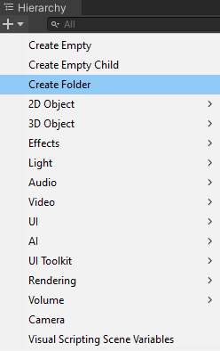
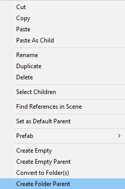
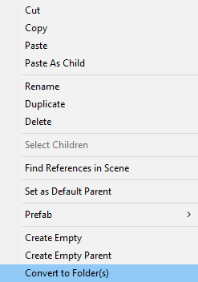

## Get Started
There is no additional setup required after importing the package into your project. Only thing to keep in mind is that folders have some rules they need to follow, these can be found [here](#folder-rules).

The easiest way to create a folder is to open the hierarchy create menu and click `Create Folder`.

You can also create a new folder as a parent of an existing game object by selecting it and clicking `Create Folder Parent`.

If importing into a project which uses normal game objects as containers you can also convert those containers into folders by selecting those you want to convert and clicking `Convert to Folder(s)`. This will convert all selected eligible game objects to folders.  

## Folder Rules
Folders have some rules of where they are allowed to exist. If these rules are not all fulfilled the create menu buttons will not appear.

- A folder must either be a scene root object or have a folder as a parent.
- A folder can not exist within a prefab.
- A folder can exist but can't be created in playmode.

Though not fully enforced, a folder should also not have any other components on them as these will be lost when the folder is stripped.