# Unity Utilities
This repository is a collection of tools and utilities I have built when working with Unity. These tools include single-file utilities for more specific needs like field attributes but also larger packages, like a behaviour tree system, depending on the scope of the issue. Any settings regarding these utilities can be found as menu items at `Tools > Jackey > _`.

Everything in this repository is free to use and modify however you see fit. If there is something you want to added or changed, feel free to let me know.

# Table of Contents
  
- [Packages](#packages)
	- [Object Behaviours](#object-behaviours--link)
	- [Object Pool](#object-pool--link)
	- [Hierarchy Organizer](#hierarchy-organizer--link)
	- [Event Bus](#event-bus--link)
	- [Selection History](#selection-history--link)
- [Utilities](#utilities)
	- [References](#references)
		- [SceneReference](#scenereference--link)
		- [ResourceReference](#resourcereference--link)
	- [Attributes](#attributes)
		- [Autofill](#autofill--link)
		- [If Attributes](#if-attributes--link)
		- [ReadOnly](#readonly--link)
		- [ExposeObject](#exposeobject--link)
		- [HideInNormalInspector](#hideinnormalinspector--link)
		- [Validator](#validator--link)
		- [OfType](#oftype--link)
		- [Inline](#inline--link)
		- [Layer](#layer--link)
		- [Tag](#tag--link)
		- [NavMeshAreaMask](#navmeshareamask--link)
		- [CurveSettings](#curvesettings--link)
		- [DisplayName](#displayname--link)
	- [Other Utilities](#other-utilities)

# Packages
All work on my packages can be found in separate branches following the naming convention of `plugin/{name of package}`. Though the most stable versions will be present on the `master` branch. Everything that is needed to use a package is available in their respective [Plugins](Assets/Plugins/) folder. You can also find the latest version of each package on the `master` branch as Unity packages in the [Releases](Assets/Plugins/_Releases/) folder.

## Object Behaviours | [Link](Assets/Plugins/Behaviours)

Object behaviours is my take on implementing behaviours for game objects. It currently only supports behaviour trees but is planned to have finite state machines as well sometime in the future.

One of my main goals have been to reduce tree traversal as much as possible and only tick nodes that actually require being ticked to reduce overhead in deep trees.

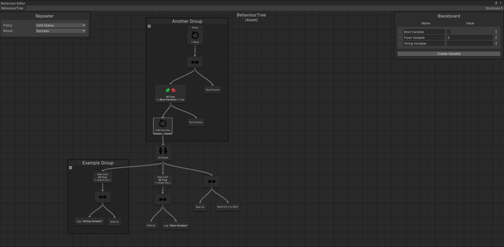
The editor window style is inspired by [NodeCanvas](https://assetstore.unity.com/packages/tools/visual-scripting/nodecanvas-14914), another behaviour package available on the Unity asset store.

> Disclaimer: I haven't used my `Object Behaviours` yet in a large scale project. It's in use in my personal hobby project but nothing bigger than that. It should work but it has not been tested at scale. 

## Object Pool | [Link](Assets/Plugins/ObjectPool/)

One of many object pool implementations out there. This one is designed to look and work like Unity's normal `Object.Instantiate()` and `Object.Destroy()`, the only difference being that you replace `Object` with `ObjectPool` resulting in `ObjectPool.Instantiate()` and `ObjectPool.Destroy()`. 

Aside from Unity objects, there is also `ObjectPool.New()` and `ObjectPool.Delete()` for normal C# objects. 

All pools are global and shared by default, either based on the original `UnityEngine.Object` or the C# type. They also have additional features like automatically returning objects when a condition is true and callbacks on the objects themself when their pool interacts with them.

It also comes with an editor window to display all global pools and their objects. This lets you see in realtime how objects are shuffled around and make sure that they are properly returned.

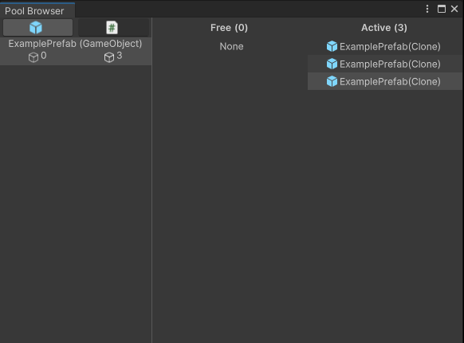

> Disclaimer: I haven't used my `Object Pool` yet in a large scale project. It's in use in my personal hobby project but nothing bigger than that. It should work but its not been tested at scale.

## Hierarchy Organizer | [Link](Assets/Plugins/HierarchyOrganizer/)

Hierarhy Organizer is a collection of tools to let you improve the structure of your scene hierarchies. It lets you create folders that you can organize game objects under. These folders may only exist as scene root game objects or children of another folder. 

> Folders are not meant to be in prefabs. If you attempt to add a folder to a prefab or create a new prefab with folders, an error message will be shown and the prefab won't be saved.

These folders will by default be removed from builds, thus removing any overhead caused by using normal game objects. 

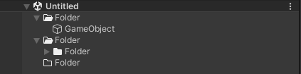

This package also has settings to enable drawing indent guides in the hierarchy window making it easier to at a glance visualize the hierarchal relationship of game objects. 

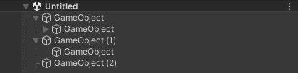

## Event Bus | [Link](Assets/Plugins/EventBus/)

The `EventBus` is a globally accessed interface for sending events. It is especially useful for many -> many events which can be hard to properly subscribe to and unsubscribe from.

It uses an `IEvent` interface to mark types as passable events. Each event can contain whatever data it requires and anything can listen to it. Just implement `IEventBusListener<>` or subscribe with a delegate.

```cs
public class ExampleMonoBehaviour : MonoBehaviour, IEventListener<ExampleEvent> {
	private void OnEnable() {
		// Subscribe to a single event
		EventBus.Subscribe<ExampleEvent>(this);
		
		// Or subscribe to all events that this class implements at once
		EventBus.SubscribeAll(this);
	}

	private void OnDisable() {
		// Unsubcribe from a single event
		EventBus.Unsubscribe<ExampleEvent>(this);

		// Or unsubscribe from all events
		EventBus.UnsubscribeAll(this);
	}

	private void Update() {
		// ...

		// The event is invoked by calling the Invoke method and can be invoked by anything
		EventBus.Invoke(new ExampleEvent());

		// ...
	}

	public void OnEvent<ExampleEvent>(ExampleEvent args) {
		// ...
	}	
}

public struct ExampleEvent : IEvent {
	// ...
}
```

It also comes with an editor window showing all events as well as their listeners and callbacks currently subscribed to it. This can for example give you hints if something doesn't unsubscribe correctly. 

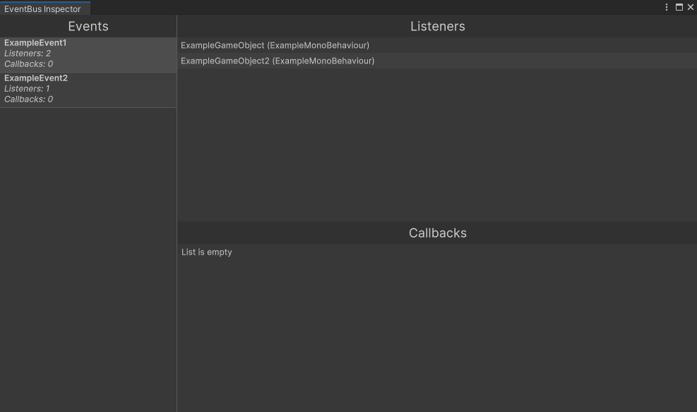

> Events show up in the list if they have been used once.

## Selection History | [Link](Assets/Plugins/SelectionHistory/)

Selection History is a small editor-only package which keeps track of which assets and/or scene objects you select. You can assign shortcuts to navigate backwards and forwards in the history as well as view your history in a window. Useful if you are constantly jumping back and forth between assets in different folders.

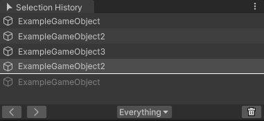

# Utilities

## References

### SceneReference | [Link](Assets/Scripts/Utilities/Unity/SceneReference.cs)

`SceneReference` allows for referencing scene assets in runtime instead of relying on the name of the scene or its build index. Creating a serialized field of a `SceneReference` will show an Object field of type `SceneAsset` in the inspector. Opening the context menu on an assigned `SceneReference` field will allow you to load it in single or additive mode as well as add/remove/toggle the scene in build settings.

```cs
public class ExampleMonoBehaviour : MonoBehaviour { 
	public SceneReference Example;
}
```

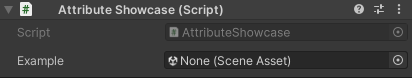

### ResourceReference | [Link](Assets/Scripts/Utilities/Unity/ResourceReference.cs)

`ResourceReference` allows for weak references to assets located within `Resources/` folders instead of relying on a string field having to match its name. It shows up as a normal Object field but will highlight if the asset is not within a `Resources/` folder so you can take necessary action.

```cs
public class ExampleMonoBehaviour : MonoBehaviour { 
	public ResourceReference<GameObject> Example;
}
```
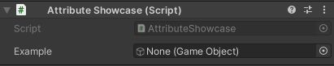

## Attributes

### Autofill | [Link](Assets/Scripts/Utilities/Attributes/AutofillAttribute.cs)

`Autofill` searches and fills in empty Unity object references in MonoBehaviours as long is the component is being inspected. Great to reduce drag and dropping if you are expecting a certain structure in your game object hierarchies and helps ensure that necessary fields don't end up empty and forgotten.

### If Attributes | [Link](Assets/Scripts/Utilities/Attributes/IfAttribute.cs)

If attributes let you add conditional rendering of fields based on the values of other fields. The current if attributes are `EnableIf` and `ShowIf`. These can check against Unity objects, bools as well as numbers.

```cs
public bool ExampleBool;
[ShowIf(nameof(ExampleBool), IfAttribute.BoolComparison.Equal, true)]
public int ShowIfTrue;

[Space]
public UnityEngine.Object ExampleObject;
[ShowIf(nameof(ExampleObject), IfAttribute.ObjectComparison.NotNull)]
public int ShowIfNotNull;

[Space]
public float ExampleFloat;
[EnableIf(nameof(ExampleFloat), IfAttribute.NumberComparison.Greater, 1)]
public int EnableIfGreaterThan1;
[EnableIf(nameof(ExampleFloat), IfAttribute.NumberComparison.Less, 1)]
public int EnableIfLessThan1;
```

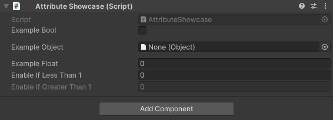

### ReadOnly | [Link](Assets/Scripts/Utilities/Attributes/ReadOnlyAttribute.cs)

The `ReadOnly` attribute lets you control whether a field can be edited in the normal inspector. It takes a parameter to optionally allow editing in different environments, for example enable editing in edit mode but disable it in play mode.

> Note that fields with this attribute can still always be edited in the inspector's debug view.

### ExposeObject | [Link](Assets/Scripts/Utilities/Attributes/ExposeObjectAttribute.cs)

The `ExposeObject` attribute lets you edit the properties of any assigned Unity object as if they were part of the selected object. Any changes made in this dropdown directly modifies the referenced object.

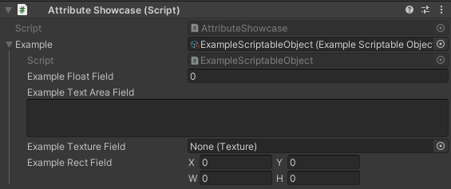

> ⚠ Some fields that use custom drawers might not look as expected but all default Unity fields and C# primitives do. 

### HideInNormalInspector | [Link](Assets/Scripts/Utilities/Attributes/HideInNormalInspectorAttribute.cs)

Unity's built-in `HideInInspector` attribute hides the field from the inspector completely. This makes it not even visible in the inspector's debug view. The `HideInNormalInspector` attribute instead hides it in the normal inspector but keeps it visible in the debug view.

### Validator | [Link](Assets/Scripts/Utilities/Attributes/ValidatorAttribute.cs)

The `Validator` attributes lets you assign a validation method for a specific field when it changes in the inspector as an alternative to `OnValidate`. For value types it also tells you the change without having to create another field to hold the old value and check against it in `OnValidate`. 

It can also be used to just run code whenever a field changes. 

```cs
[Validator(nameof(ValidateStruct))] 
public int ExampleStruct;

private int ValidateStruct(int old, int next) {
	// Perform your validation and return the correct value
	return next;
}

[Validator(nameof(ValidateClass))] 
public CustomSerializableClass ExampleClass;

private void ValidateClass(CustomSerializableClass value) {
	// Perform your validation on the value itself
}
```

### OfType | [Link](Assets/Scripts/Utilities/Attributes/OfTypeAttribute.cs)

The `OfType` attribute adds a second required type to a Unity object field. It's a way to add serialization of normally unsupported types such as interfaces as well as adding drag'n drop support to them.

```cs
[OfType(typeof(IExampleInterface))]
public MonoBehaviour Example;
```
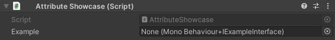

### Inline | [Link](Assets/Scripts/Utilities/Attributes/InlineAttribute.cs)

The `Inline` attribute draws a field's child properties on a single line. On custom serializable classes it removes the foldout that normally appears. This is mostly intended for types with 2-3 fields, as they can get very small, but it's usable on types with more.

```cs
[Inline]
public CustomSerializableClass Example;

// ...

[Serializable]
public class CustomSerializableClass {
	public ScriptableObject Field1;
	public int Field2;
}
```

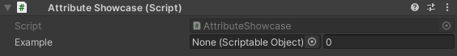

> ⚠ Some fields that use custom drawers might not look as expected but all default Unity fields and C# primitives do. 

### Layer | [Link](Assets/Scripts/Utilities/Attributes/LayerAttribute.cs)

The `Layer` attribute transforms an int field to a layer field letting you select a layer available in the project. Like a `LayerMask` but only one layer can be assigned.

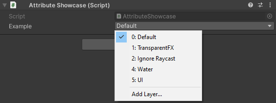

### Tag | [Link](Assets/Scripts/Utilities/Attributes/TagAttribute.cs)

The `Tag` attribute transforms a string field into a dropdown that only accepts tags present in the project.

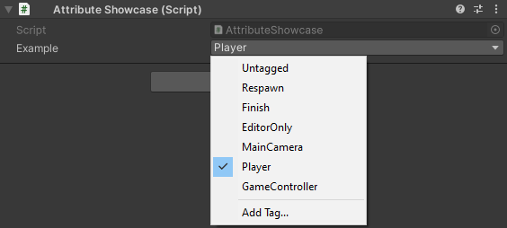

### NavMeshAreaMask | [Link](Assets/Scripts/Utilities/Attributes/NavMeshAreaMaskAttribute.cs)

The `NavMeshAreaMask` attribute transforms an int field into a mask of the available NavMeshAreas in the project.

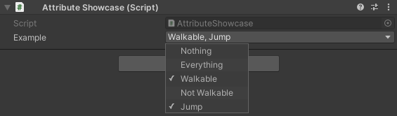

### CurveSettings | [Link](Assets/Scripts/Utilities/Attributes/CurveSettingsAttribute.cs)

The `CurveSettings` attribute lets you decide a range of valid values for an animation curve on both the x and y axis.

```cs
[CurveSettings(0f, 1f, -1f, 1f)]
public AnimationCurve ExampleCurve;
```

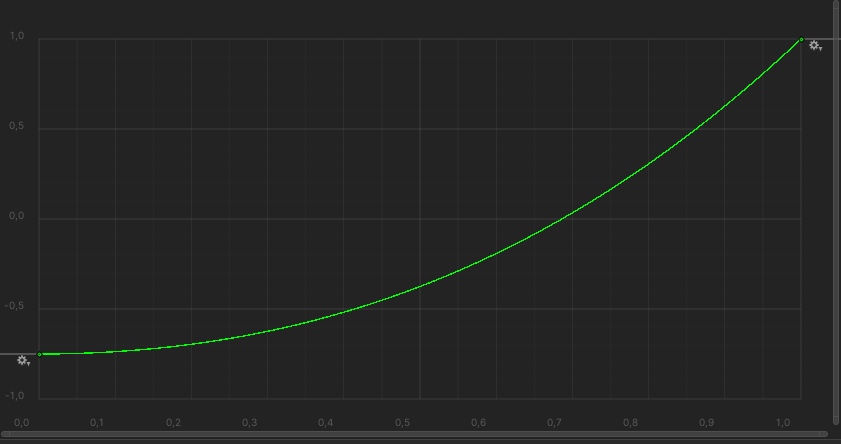

### DisplayName | [Link](Assets/Scripts/Utilities/Attributes/DisplayNameAttribute.cs)

The `DisplayName` attribute on a field overrides the label of the field when drawn in the inspector.

## Other Utilities

Aside from the utilities described above, I also have some other mixed ones in the [Assets/Scripts/Utilities/](Assets/Scripts/Utilities/) folder. These are mostly simple quality of life extension methods and static utility methods but also some other useful things like a `SerializableGUID` type.